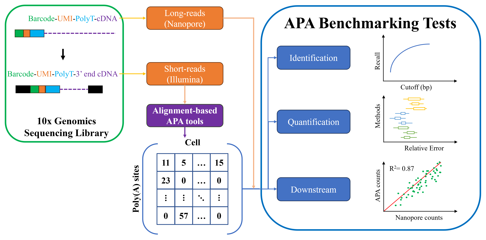
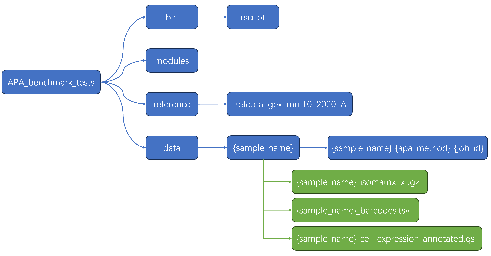

# APA benchmark tests
This is a benchmark pipeline based on Nextflow, designed to evaluate the performance of APA (Alternative Polyadenylation) analysis tools for single-cell transcriptomics (or spatial transcriptomics) based on 3' sequencing.

## Overview




The pipeline is divided into two main parts:

1. **Data Preparation**: This part reads the outputs from APA analysis tools and ONT (Oxford Nanopore Technologies), converts them into a standard format, and normalizes the data.

2. **Performance Evaluation**: This part consists of three modules:
   - **Site Identification Comparison**: Compares the identified polyadenylation sites.
   - **Site Quantification Comparison**: Compares the quantification of polyadenylation sites.
   - **Differential Expression Analysis Comparison**: Compares the differential expression analysis of polyadenylation sites.
  
## Requirments

1. Install Nextflow (version 23.04.3.5875)
2. Install R (version > 4.1)
3. Install some R packages:
   + GenomicRanges
   + DESeq2
   + argparse
   + qs
   + import

## Directory structure



This pipeline consists of four directories: 

	+ bin: R scripts 
	+ modules: Nextflow processes 
	+ Reference: annotation files (gtf and fasta) from Cell Ranger 
	+ data: store the required sample data, named in the format ${sample_name}_illumina. The sample data includes: 
		- outputs from various APA analysis methods, 
		- Illumina data (from Cell Ranger), 
		- ONT data, 
		- metadata.
		
## Usage

```
nextflow run main.nf --sample_name MOBV1 --apa_method Sierra --core_num 4 --win_size 50 --cv_cutoff "none"
```

## Citation
